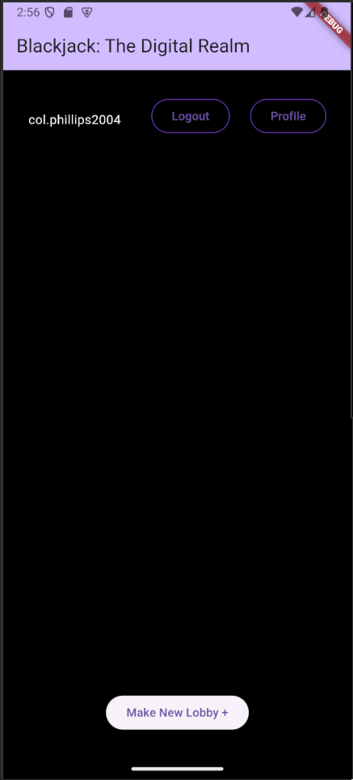
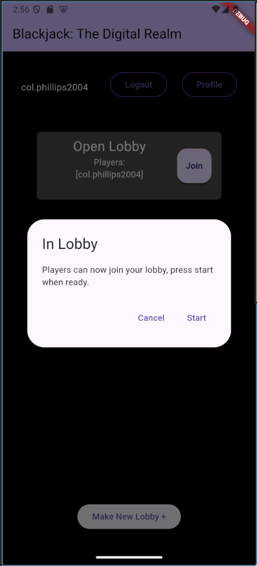
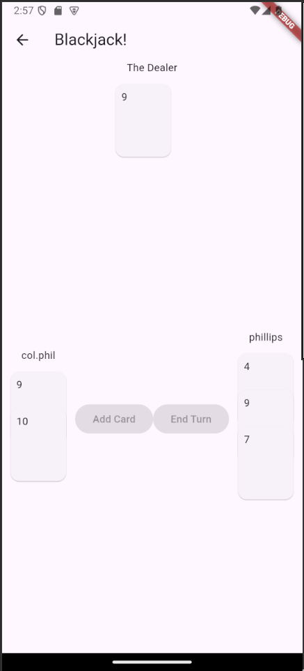

# Blackjack: The Digital Realm

A sleek and minimal re-imagining of blackjack, for the modern age.

## Usage

This is an app for anyone who wants to play blackjack.
No matter the distance between players, anyone can easily connect in *Blackjack: The Digital Realm*.

Create a lobby, wait for people to join, then press start.
Or, join a lobby with the Join button, and wait for the host to press start.

After playing a round, the Results screen will display who won the hand.

## Screenshots

## EOL

This is a learning project, and I will likely have shut down the firebase project that powers this by December 2024.
